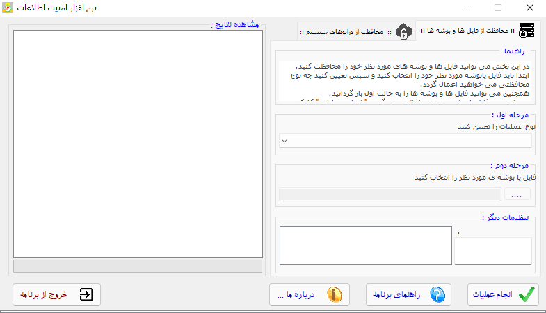
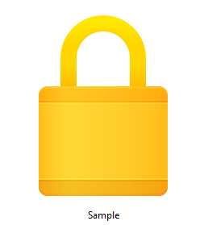
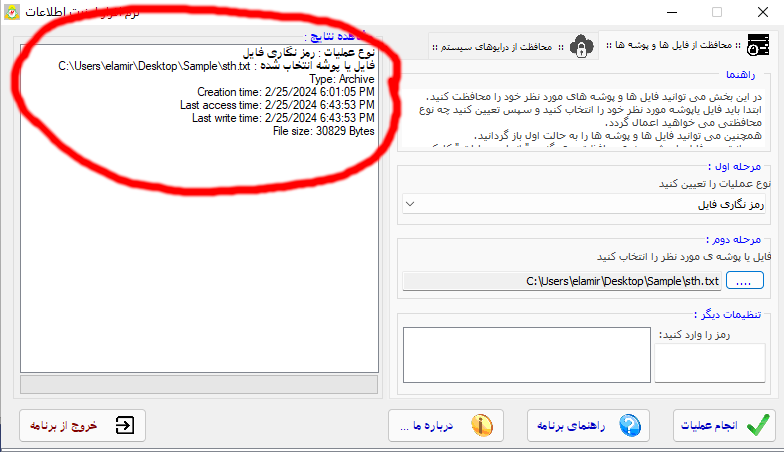
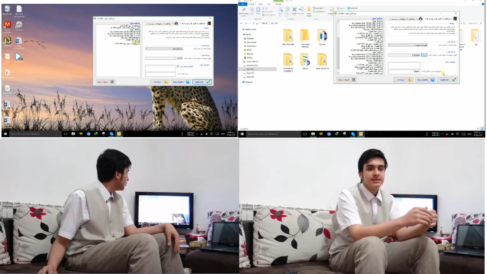

## 
 ATTENTION: THIS PROJECT IS DISCONTINUED 

	
	 
	<h1>NAE: Data Security Application For Windows</h1>

# Features
<ol>
  <li>Encryption/Decrytion</li>
  
This application uses AES-256 as the encryption algorithm and encrypted files are given a <strong>.msh</strong> extention, the former extention is added before the <strong>.msh</strong> and after a <strong>@-@</strong> mark just as this photo:
 
  <li>Wiping out files/folders</li>
  
You can use this app to wipe out files with leaving minor trace on the hard drive from that file, this feature is brought to the app using <strong>sdelete</strong> command-line application.

  <li>Locking folders</li>
  
The locking mechanism is adding the so called "Magic Code" after the folder's name which turns it's icon into a lock and not openable via the file browser (though it's still accessible via the command line)
 
  <li>Hiding files/folders/volumes</li>
  
Hiding files and folders are achieved using the attrib command and hiding volumes and disks are achieved with removing the volumes index letter which removes it from the file browser (while keeping all the data within it intact).

  <li>Making files/volumes write-protected/readonly</li>
  
The files are made write-protected by setting it's name to AUX, which is a reserved name in Windows (upto 10) and thus you can't delete the file from the browser, <em>this method is NOT useful for Windows 11</em> as there is no restriction on deleted files with reserved names in Windows 11.
 
    
The disks are write protected using Windows internal Diskpart utility.

</ol>
    
## Logging

Proper live logging is integrated into the app and you can watch the apps actions as it takes them.

# Why is this app so bad?

I looked like this when I wrote this app in 2015 :), and my primary OS was Windows 10 which I haven't used or programmed on for a couple of years, refining the app heavily takes some time for me which includes the time I need to review my VB.NET knowledge too.

P.S: Me explaining the app to the camera for highschool competition

